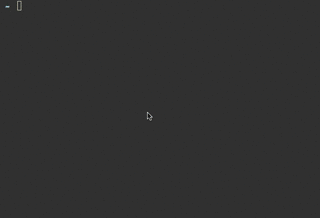

todo-app
========

Welcome! If you're here, then you'll probably looking for a simple todo-app.
Well this is simple enough (of course it's a little feature-less now), and you 
can use it through command line: 



# Installation
After you cloned the repo just hit `npm install` to your terminal to install 
the dependencies. If you want to use it from anywhere, you can symlink the 
shell script (`task`) to your binary folder, or just add it to your PATH.

# Usage
## List your tasks
```SHELL 
task
```

## Add a new task
```SHELL 
task add "Your new awesome title" "What is the purpose of this new great task of yours?"
```

## Show a task 
```SHELL 
task "part of the title"
```

## Complete your task
```SHELL 
task complete "part of the title"
```

## Delete your task 
```SHELL 
task delete "part of the title"
```
